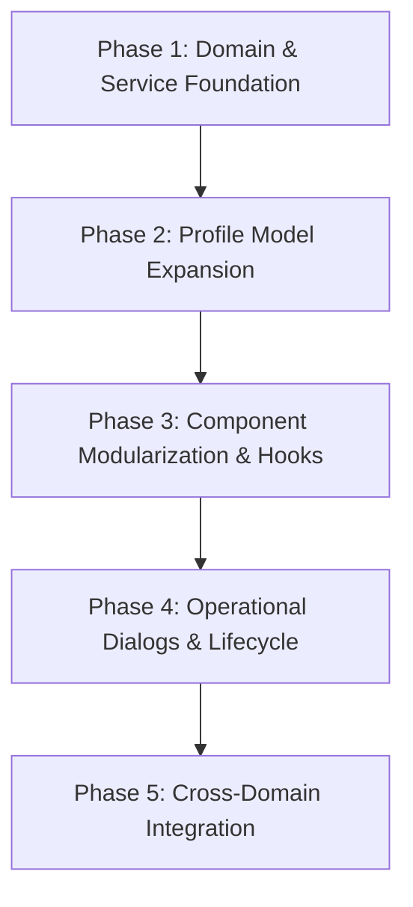

# Residents Module Audit Report

**Module:** Residents (`src/features/residents`)  
**Audit Date:** 21 July 2026  
**Status:** Audit Complete (No code modified)  
**Target File:** `docs/audits/RESIDENT_MODULE_AUDIT.md`  

---

## Executive Summary

A complete audit of the **Residents module** in RPGMS 2.0 was conducted. The audit evaluated the folder structure, components, pages, dialogs, types, services, mock data, routing, state management, and overall alignment with core architecture guidelines (`PROJECT_RULES.md`, `ARCHITECTURE.md`, `RESIDENT_ARCHITECTURE.md`, and `RESIDENT_PROFILE_SPECIFICATION.md`).

The Residents module currently presents a functional MVP user interface for listing residents, onboarding new residents via a step-by-step wizard, and viewing/editing basic resident profile details. However, structurally it combines permanent resident identity with operational stay/occupancy data on a single object, omits key profile specification fields, lacks a service/hook abstraction layer, and currently has no dialogs or lifecycle workflow components.

---

## 1. Existing Implementation

### Folder Structure
The current directory structure of the module is located at `src/features/residents`:

```text
src/features/residents/
├── components/
│   └── ResidentOnboardingWizard.tsx    (24 KB - 3-step onboarding wizard)
├── data/
│   └── mockResidents.ts                (1.1 KB - Initial seed data)
├── hooks/                              (EMPTY DIRECTORY)
├── pages/
│   ├── ResidentOnboardingPage.tsx      (1.4 KB - Wrapper for onboarding wizard)
│   ├── ResidentProfilePage.tsx         (21.8 KB - Profile view and inline editing)
│   └── ResidentsPage.tsx               (10.8 KB - Resident registry list & metrics)
├── services/                           (EMPTY DIRECTORY)
├── types/
│   └── index.ts                        (1.1 KB - Resident & Document type definitions)
├── utils/
│   └── formatters.ts                   (0.2 KB - Title case formatting helper)
└── index.ts                            (0.4 KB - Feature public barrel export)
```

### Components
- **`ResidentOnboardingWizard.tsx`**: A 670-line multi-step wizard component managing a 3-step onboarding flow:
  1. *Resident Identity*: Full Name, Mobile Number, Document Type, Document Number.
  2. *Accommodation Details*: Joining Date, Flat Selection, Bed Checkboxes, Agreed Rent/Deposit calculation and manual override.
  3. *Confirmation Summary*: Overview of all inputs before transactional creation.
  - Implements automatic bed vacancy filtering, rent/deposit summation per selected beds, auto-generation of `residentCode` (e.g. `R000001`), and dual `localStorage` updates (`rpgms_residents` and `rpgms_flats`).

### Pages
- **`ResidentsPage.tsx` (`/residents`)**:
  - Displays summary metric cards (Total Residents, Active, On Notice, Checked Out).
  - Search toolbar (matches Resident Code, Name, Mobile Number, Flat Name, Bed Name).
  - Status filter dropdown (`ALL`, `ACTIVE`, `ON_NOTICE`, `CHECKED_OUT`, `ALUMNI`).
  - Interactive table displaying resident list with status chips and "View Profile" navigation.
- **`ResidentOnboardingPage.tsx` (`/residents/new`)**:
  - Page shell hosting `ResidentOnboardingWizard` with header and back navigation.
- **`ResidentProfilePage.tsx` (`/residents/:id`)**:
  - Profile header with resident name, resident code, flat/bed assignment, joining date, and status chip.
  - Tabbed/sectioned view for Identity Details, Accommodation Details (Read-Only), and Commercial Agreement.
  - Inline editing state for Identity and Commercial terms with validation and `localStorage` sync.
  - System metadata sidebar (System ID, Created At, Last Updated At).

### Dialogs
- **None**: No dialog components exist in the module. Onboarding takes place on a dedicated page (`/residents/new`), editing is inline within `ResidentProfilePage`, and no modal dialogs exist for lifecycle actions (e.g., Mark On Notice, Checkout, Bed Transfer, Re-admission).

### Types
Defined in `src/features/residents/types/index.ts`:
- **`ResidentStatus`**: `'ACTIVE' | 'ON_NOTICE' | 'CHECKED_OUT' | 'ALUMNI'`
- **`DocumentType`**: `'AADHAAR' | 'PASSPORT' | 'DRIVING_LICENSE' | 'PAN' | 'VOTER_ID' | 'GOVERNMENT_ID' | 'OTHER'`
- **`Resident` interface**:
  - `id`: `string`
  - `residentCode`: `string`
  - `fullName`: `string`
  - `mobileNumber`: `string`
  - `documentType`: `DocumentType`
  - `documentNumber`: `string`
  - `joiningDate`: `string`
  - `flatId`: `string`
  - `allocatedBedIds`: `string[]`
  - `agreedRent`: `number`
  - `agreedDeposit`: `number`
  - `status`: `ResidentStatus`
  - `createdAt`: `string`
  - `updatedAt`: `string`
- **`ResidentDraft` interface**: Subset of `Resident` fields without system IDs and metadata.

### Services
- **None**: `src/features/residents/services/` is an empty folder. Business logic, `localStorage` querying/saving, auto-code generation, and accommodation status mutations are executed directly within UI components.

### Mock Data
Defined in `src/features/residents/data/mockResidents.ts`:
- Two initial mock records (`Arjun Sharma` R000001 in Flat 101, `Priya Patel` R000002 in Flat 102).
- Serves as default seed data if `rpgms_residents` is not present in `localStorage`.

### Routing
Registered in `src/app/router.tsx`:
- `/residents` -> `ResidentsPage`
- `/residents/new` -> `ResidentOnboardingPage`
- `/residents/:id` -> `ResidentProfilePage`
- Linked in `Sidebar.tsx` navigation menu under "Residents".

### State Management
- Managed locally per component using React `useState` hooks.
- Direct read/write calls to browser `localStorage` (`rpgms_residents` and `rpgms_flats`).
- No global state management store or custom React hooks (`src/features/residents/hooks/` is empty).

---

## 2. Features Already Implemented

| Feature | Location | Status | Description |
|---------|----------|--------|-------------|
| **Residents Registry Table** | `ResidentsPage.tsx` | Complete | Interactive table displaying all residents with status chips and navigation to profile. |
| **Search & Filtering** | `ResidentsPage.tsx` | Complete | Multi-field text search (Code, Name, Mobile, Flat, Bed) and status dropdown filter. |
| **Summary Metrics** | `ResidentsPage.tsx` | Complete | Metric cards showing Total, Active, On Notice, and Checked Out counts. |
| **3-Step Onboarding Wizard** | `ResidentOnboardingWizard.tsx` | Complete | Stepper interface for Identity, Bed Allocation, and Summary Confirmation. |
| **Dynamic Bed Selection** | `ResidentOnboardingWizard.tsx` | Complete | Filters vacant beds from `rpgms_flats` and supports multi-bed allocation. |
| **Rent & Deposit Overrides** | `ResidentOnboardingWizard.tsx` | Complete | Auto-calculates totals based on bed defaults with option for manual override and reset. |
| **Resident Code Generator** | `ResidentOnboardingWizard.tsx` | Complete | Generates incremental codes in `R000001` format. |
| **Profile View** | `ResidentProfilePage.tsx` | Complete | Displays identity, accommodation allocation, commercial agreement, and system metadata. |
| **Profile Inline Editing** | `ResidentProfilePage.tsx` | Complete | Allows editing name, mobile, document info, rent, and deposit with inline validation. |
| **Title Case Formatter** | `utils/formatters.ts` | Complete | Formats resident names to title case automatically upon blur. |

---

## 3. Architecture Alignment

The implementation was evaluated against project governance standards in `PROJECT_RULES.md`, `ARCHITECTURE.md`, `RESIDENT_ARCHITECTURE.md`, and `RESIDENT_PROFILE_SPECIFICATION.md`.

### Summary: Partially Aligned (UI Layer) / Structurally Misaligned (Domain Layer)

#### 1. Violation of Resident vs. Stay Separation (CRITICAL)
- **Architectural Requirement**: `docs/ARCHITECTURE.md` (Section: Resident and Stay Architecture) and `docs/resident/RESIDENT_ARCHITECTURE.md` explicitly state:
  > *"A Resident represents a person... A Stay represents one continuous period of accommodation... A Resident may have multiple Stays throughout their lifetime... Each Stay owns its own Accommodation, Commercial Terms, Contract, Billing, Ledger, Compliance, and Lifecycle."*
- **Current Implementation**: The current `Resident` TypeScript interface directly attaches operational stay attributes (`flatId`, `allocatedBedIds`, `agreedRent`, `agreedDeposit`, `joiningDate`, `status`) to the `Resident` entity.
- **Impact**: Returning residents (Alumni re-admissions) cannot be handled without overwriting operational history or duplicating person records, violating Core Rule: *"Never duplicate a resident for readmission. Admissions are historical records and are never rewritten."* (`PROJECT_RULES.md` Line 430).

#### 2. UI Owning Business Logic & Side Effects
- **Architectural Requirement**: `PROJECT_RULES.md` (Architecture Standards) and `ARCHITECTURE.md` (Layer Responsibilities):
  > *"UI components are responsible only for presentation, user interaction, validation, and orchestration... Business logic belongs in reusable utilities or domain services."*
- **Current Implementation**: `ResidentOnboardingWizard.tsx` directly performs bed occupancy updates on `rpgms_flats`, rent calculations, code generation, and `localStorage` transactions within component event handlers.

#### 3. Empty Layer Directories
- Both `src/features/residents/services` and `src/features/residents/hooks` are completely empty. No service abstraction or custom hooks exist for resident management.

---

## 4. Missing Functionality

Based on `RESIDENT_PROFILE_SPECIFICATION.md` and `RESIDENT_ARCHITECTURE.md`, the following capabilities are currently unaddressed:

### A. Extended Resident Profile Specifications
- **Personal Identity**: Preferred Name, Date of Birth, Gender, Nationality, Marital Status, Photograph URL/Upload.
- **Contact Details**: Separate Voice Call Number vs. WhatsApp Number fields, Alternate Contact, Email Address.
- **Government Identification**: Distinct fields for Aadhaar Number, PAN Number, Passport Number, Driving Licence Number, Voter ID Number (currently only a single `documentType` + `documentNumber` pair).
- **Address Information**: Permanent Address (Line 1, Line 2, Landmark, City, State, Pincode, Country) and Correspondence Address ("Same as Permanent" checkbox).
- **Emergency Contact**: Contact Name, Relationship, Voice Call Number, WhatsApp Number, Alternate Number, Email.
- **Parent / Guardian Information**: Name, Relationship, Voice Call Number, WhatsApp Number, Email.
- **Education / Employment**: Occupation Dropdown (Student, Working Professional, Self-Employed, etc.), Organization/Institution Name, Department, Course/Designation, Employee/Student ID, Work/Study Location.
- **Medical Information**: Voluntary health notes, emergency medical details, allergies, blood group.
- **Resident Documents**: Document attachments/file uploads.

### B. Lifecycle Actions & Dialog Workflows
- **Mark On Notice Workflow**: Dialog/form to capture Notice Date, auto-suggest Checkout Date (Notice + 30 days), record notice reason, and transition status to `ON_NOTICE`.
- **Checkout & Settlement Workflow**: Dialog/form to record actual Checkout Date, initiate financial deposit refund/deduction recommendations, release allocated bed(s) to `VACANT`, and transition status to `CHECKED_OUT` / `ALUMNI`.
- **Bed Transfer Workflow**: Dialog to transfer an active resident to another vacant bed/area/flat without terminating the Stay, recording a `Bed Transfer` Stay Event.
- **Readmission Workflow**: Creating a new Stay for an existing `ALUMNI` resident without creating duplicate person records.

### C. Stay Events & Domain Event Integration
- **Stay Event Log**: Chronological timeline of events during a stay (Check-in, Bed Assignment, Bed Transfer, Rent Revision, Notice Given, Checkout).
- **Domain Event Triggers**: Emitting events upon admission/checkout to notify Finance (ledger creation, deposit ledger setup), Compliance (police intimation), and Door IDs (access credential assignment).

---

## 5. Code Quality Observations

### Strengths
1. **Clean UI & Modern Styling**: Built using Material UI v6 with consistent typography, modern color tokens, rounded surface borders, chips, and responsive grids.
2. **Robust Wizard UX**: Step validation, touch state tracking, helper text for manual price overrides, and explicit confirmation step before creation.
3. **TypeScript Compliance**: Strictly typed props, interfaces, and enums (`ResidentStatus`, `DocumentType`, `BedStatus`).
4. **Resilient Local Storage Fallbacks**: Graceful fallback to `mockResidents` if local storage is empty.

### Weaknesses & Code Smells
1. **Monolithic Component Files**:
   - `ResidentOnboardingWizard.tsx` (670 lines) contains wizard navigation, step 1 form, step 2 bed selector, pricing override math, step 3 confirmation cards, and dual-table `localStorage` mutation logic in a single file.
   - `ResidentProfilePage.tsx` (596 lines) mixes page header, status chips, view mode grids, edit mode form fields, validation error state, and saving logic.
2. **Scattered Data Operations**: Direct `localStorage.getItem` and `localStorage.setItem` calls are duplicated across `ResidentsPage`, `ResidentProfilePage`, and `ResidentOnboardingWizard`.
3. **Manual String Manipulation for Bed IDs**: Utility logic like `bedId.match(/[^-]+$/)` is repeated across `ResidentsPage`, `ResidentProfilePage`, and `ResidentOnboardingWizard` instead of being centralized in `utils/formatters.ts`.
4. **Lack of Automated Tests**: Zero unit tests or integration tests exist for resident data formatting, code generation, or onboarding transactions.

---

## 6. Refactoring Recommendations

> **Note:** As per user instructions, **no code has been modified** during this audit. The following recommendations are provided for future implementation tasks.

1. **Extract Domain Model (Resident vs. Stay)**:
   - Refactor `src/features/residents/types/index.ts` to separate `ResidentProfile` (person identity, contact, address, guardian, employment) from `Stay` (admission date, flat allocation, bed IDs, commercial terms, lifecycle status).
2. **Create Service Layer (`src/features/residents/services/`)**:
   - Create `residentService.ts`: CRUD operations for resident identity, searching, filtering, and profile persistence.
   - Create `stayService.ts`: Check-in, bed assignment, notice submission, checkout settlement, and bed transfer transactions.
3. **Create Custom Hooks Layer (`src/features/residents/hooks/`)**:
   - `useResidents()`: Encapsulate state, search, status filtering, and metrics calculation.
   - `useResident(id)`: Encapsulate fetching, saving, and editing a single resident profile.
   - `useOnboarding()`: Encapsulate wizard step state, bed vacancy fetching, pricing math, and submission handling.
4. **Decompose Monolithic UI Components**:
   - Split `ResidentOnboardingWizard.tsx` into smaller components:
     - `OnboardingStepIdentity.tsx`
     - `OnboardingStepAccommodation.tsx`
     - `OnboardingStepSummary.tsx`
   - Split `ResidentProfilePage.tsx` into section components:
     - `ProfileIdentityCard.tsx`
     - `ProfileContactCard.tsx`
     - `ProfileAddressCard.tsx`
     - `ProfileEmergencyContactCard.tsx`
     - `ProfileEmploymentCard.tsx`
     - `ProfileStayHistoryCard.tsx`
5. **Implement Dialog Workflows**:
   - `MarkOnNoticeDialog.tsx`
   - `CheckoutDialog.tsx`
   - `BedTransferDialog.tsx`

---

## 7. Suggested Implementation Order

To align the Residents module with RPGMS 2.0 business architecture without breaking existing application capabilities, the following phased sequence is recommended:



### Phase 1: Domain & Service Foundation
- Define `Stay` and `StayEvent` interfaces alongside `Resident` in `types/index.ts`.
- Build `residentService.ts` and `stayService.ts` to abstract `localStorage` / Supabase interactions away from UI components.
- Centralize ID parsing and formatting helpers in `utils/formatters.ts`.

### Phase 2: Profile Model Expansion
- Update `Resident` interface to include full profile specification categories (Contact split, Permanent/Correspondence Address, Emergency Contact, Parent/Guardian, Occupation/Employer, Medical info).
- Update `ResidentProfilePage.tsx` to display all profile categories with structured sections.

### Phase 3: Component Modularization & Hooks
- Create `useResidents`, `useResident`, and `useOnboarding` hooks in `src/features/residents/hooks/`.
- Modularize `ResidentOnboardingWizard.tsx` and `ResidentProfilePage.tsx` into smaller presentational sub-components.

### Phase 4: Operational Dialogs & Lifecycle
- Implement `MarkOnNoticeDialog.tsx` with auto-calculated 30-day checkout date suggestion.
- Implement `CheckoutDialog.tsx` with bed release and status transition to `CHECKED_OUT`.
- Implement `BedTransferDialog.tsx` for inter-bed transfers.
- Add Stay History timeline to `ResidentProfilePage.tsx`.

### Phase 5: Cross-Domain Integration
- Connect Resident onboarding and checkout events to **Finance** (Ledger posting and Deposit ledger creation).
- Connect Resident state to **Compliance** (Police Intimation tracking) and **Door IDs** (Access credentials).

---

*Report generated and saved to `docs/audits/RESIDENT_MODULE_AUDIT.md`.*
