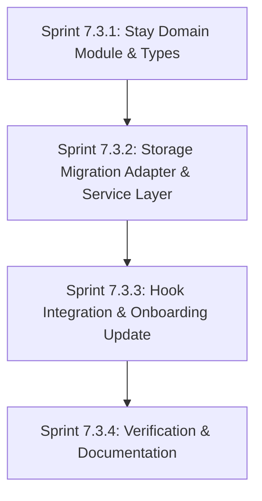

# Stay Domain Migration Plan

**Project:** RPGMS 2.0  
**Target Milestone:** Sprint 7.3 (Stay Domain Migration)  
**Document:** `docs/migration/STAY_MIGRATION_PLAN.md`  
**Status:** Planning / Pending Approval  
**Last Updated:** 22 July 2026  

---

## Executive Summary

This document defines the comprehensive migration strategy for separating operational **Stay** information from permanent **Resident** identity within RPGMS 2.0.

In accordance with `ARCHITECTURE.md` (Version 2.0) and `RESIDENT_ARCHITECTURE.md`, the Resident module currently contains both permanent person identity and operational stay attributes (`flatId`, `allocatedBedIds`, `agreedRent`, `agreedDeposit`, `joiningDate`, `status`). 

This migration establishes the **Stay domain** as the authoritative owner of all operational occupancy data while preserving 100% of existing UI, UX, routing, onboarding workflows, and `localStorage` compatibility.

---

## 1. Current State Analysis

### Current Resident Data Model
Currently, `src/features/residents/types/index.ts` defines a single monolithic `Resident` interface:

```typescript
export interface Resident {
  // Permanent Identity & Profile Fields
  id: string;
  residentCode: string;
  fullName: string;
  mobileNumber: string;
  alternateMobile?: string;
  email?: string;
  documentType: DocumentType;
  documentNumber: string;
  fatherOrGuardianName?: string;
  motherName?: string;
  emergencyContactName?: string;
  emergencyContactRelation?: string;
  emergencyContactPhone?: string;
  permanentAddress?: string;
  correspondenceAddress?: string;
  city?: string;
  state?: string;
  pinCode?: string;
  occupation?: string;
  employerOrCollege?: string;
  bloodGroup?: string;
  medicalNotes?: string;

  // Operational Stay & Commercial Fields (TO BE MIGRATED TO STAY)
  joiningDate: string;
  flatId: string;
  allocatedBedIds: string[];
  agreedRent: number;
  agreedDeposit: number;
  status: ResidentStatus;

  // Metadata
  createdAt: string;
  updatedAt: string;
}
```

### Current Onboarding Flow
- **`ResidentOnboardingWizard.tsx`**: A 3-step wizard (Identity -> Accommodation & Commercial -> Summary Confirmation).
- On submission, it creates a single `Resident` object containing both identity and accommodation fields, saves it to `localStorage` key `rpgms_residents`, and updates bed occupancy in `rpgms_flats`.

### Current Storage & Ownership
- `rpgms_residents`: Single array of `Resident` JSON objects stored in browser `localStorage`.
- `rpgms_flats`: Accommodation data stored in `localStorage`.
- Data ownership is currently coupled; `Resident` owns identity, occupancy, commercial terms, and status simultaneously.

### Current Component & Hook Dependencies
- `ResidentsPage.tsx` consumes `useResidents()`, which loads `rpgms_residents` via `residentService.ts`.
- `ResidentProfilePage.tsx` consumes `useResident(id)`, which loads and updates `rpgms_residents` via `residentService.ts`.
- `ResidentOnboardingWizard.tsx` calls `residentService.saveOnboardingTransaction()`.

---

## 2. Target Architecture

The target architecture enforces strict domain separation according to `ARCHITECTURE.md` Section 3 (Business Architecture).

```text
               ┌───────────────────────┐
               │    Resident Domain    │
               │  (Permanent Identity) │
               └───────────┬───────────┘
                           │ 1
                           │
                           │ N (At most 1 Active in MVP)
                           ▼
               ┌───────────────────────┐
               │      Stay Domain      │
               │ (Occupancy/Admission) │
               └─────┬───────────┬─────┘
                     │           │
           1..*      │           │ 1
                     ▼           ▼
┌──────────────────────┐       ┌──────────────────────┐
│ Accommodation Domain │       │    Finance Domain    │
│  (Flats, Areas, Beds)│       │  (Ledger & Accounts) │
└──────────────────────┘       └──────────────────────┘
```

### Domain Boundaries & Ownership

1. **Resident Domain (`src/features/residents`)**:
   - Represents a human being.
   - **Owns**: Permanent person identity, contact details, family information, emergency contacts, residential/mailing addresses, educational/professional affiliation, and medical notes.
   - **Lifecycle**: Permanent record. Never deleted. Preserved across multiple admissions/stays.

2. **Stay Domain (`src/features/stay`)**:
   - Represents one continuous period of accommodation (an admission).
   - **Owns**: `stayId`, `residentId`, `checkInDate` (formerly `joiningDate`), `checkOutDate`, `noticeDate`, `expectedCheckOutDate`, `flatId`, `allocatedBedIds`, `agreedRent`, `agreedDeposit`, `status` (`ACTIVE`, `ON_NOTICE`, `CHECKED_OUT`, `CLOSED`), and chronological `stayEvents` log.
   - **Lifecycle**: Time-bound. Begins at Check-in and ends at Checkout.

3. **Accommodation Domain (`src/features/accommodation`)**:
   - Represents the physical property structure.
   - **Owns**: `Flat`, `Area`, `Bed`, physical capacity calculations, and bed operational status (`VACANT`, `OCCUPIED`, `RESERVED`, `ON_NOTICE`, `MAINTENANCE`, `BLOCKED`).
   - **Boundary Rule**: Does not own resident identities or contracts. Bed occupant details are derived by referencing active `Stay` records.

4. **Finance Domain (`src/features/finance`)**:
   - Immutably records financial obligations, ledger transactions, and security deposits against a `Stay`.
   - **Boundary Rule**: `Stay` is the financial boundary. Balances are derived from ledger entries.

---

## 3. Field Migration Matrix

Every field currently on `Resident` and `Bed` is explicitly assigned to its future single domain owner below:

| Current Field | Current Interface | Future Owner Domain | Target Entity / Interface | Migration Rationale |
|---|---|---|---|---|
| `id` | `Resident` | **Resident** | `Resident.id` | Permanent system ID of the person. |
| `residentCode` | `Resident` | **Resident** | `Resident.residentCode` | Permanent identifier assigned to the individual (`R000001`). |
| `fullName` | `Resident` | **Resident** | `Resident.fullName` | Personal legal name. |
| `mobileNumber` | `Resident` | **Resident** | `Resident.mobileNumber` | Primary contact number. |
| `alternateMobile` | `Resident` | **Resident** | `Resident.alternateMobile` | Secondary contact number. |
| `email` | `Resident` | **Resident** | `Resident.email` | Personal email address. |
| `documentType` | `Resident` | **Resident** | `Resident.documentType` | Government ID classification. |
| `documentNumber` | `Resident` | **Resident** | `Resident.documentNumber` | Government ID number. |
| `fatherOrGuardianName` | `Resident` | **Resident** | `Resident.fatherOrGuardianName` | Family detail. |
| `motherName` | `Resident` | **Resident** | `Resident.motherName` | Family detail. |
| `emergencyContactName` | `Resident` | **Resident** | `Resident.emergencyContactName` | Emergency contact name. |
| `emergencyContactRelation` | `Resident` | **Resident** | `Resident.emergencyContactRelation` | Emergency contact relationship. |
| `emergencyContactPhone` | `Resident` | **Resident** | `Resident.emergencyContactPhone` | Emergency contact phone. |
| `permanentAddress` | `Resident` | **Resident** | `Resident.permanentAddress` | Residential address. |
| `correspondenceAddress` | `Resident` | **Resident** | `Resident.correspondenceAddress` | Mailing address. |
| `city` | `Resident` | **Resident** | `Resident.city` | Address city. |
| `state` | `Resident` | **Resident** | `Resident.state` | Address state. |
| `pinCode` | `Resident` | **Resident** | `Resident.pinCode` | Address postal code. |
| `occupation` | `Resident` | **Resident** | `Resident.occupation` | Educational/professional affiliation. |
| `employerOrCollege` | `Resident` | **Resident** | `Resident.employerOrCollege` | Employer or institution name. |
| `bloodGroup` | `Resident` | **Resident** | `Resident.bloodGroup` | Medical info. |
| `medicalNotes` | `Resident` | **Resident** | `Resident.medicalNotes` | Medical notes. |
| `createdAt` | `Resident` | **Resident** | `Resident.createdAt` | Identity creation timestamp. |
| `updatedAt` | `Resident` | **Resident** | `Resident.updatedAt` | Identity update timestamp. |
| `joiningDate` | `Resident` | **Stay** | `Stay.checkInDate` | Operational check-in date of the admission. |
| `flatId` | `Resident` | **Stay** | `Stay.flatId` | Physical flat assigned for this stay. |
| `allocatedBedIds` | `Resident` | **Stay** | `Stay.allocatedBedIds` | Specific beds allocated for this stay. |
| `agreedRent` | `Resident` | **Stay** | `Stay.agreedRent` | Contractual rent for this stay. |
| `agreedDeposit` | `Resident` | **Stay** | `Stay.agreedDeposit` | Contractual deposit for this stay. |
| `status` | `Resident` | **Stay** | `Stay.status` | Operational state of the admission (`ACTIVE`, `ON_NOTICE`, `CHECKED_OUT`, `CLOSED`). |
| `residentName` | `Bed` (Accommodation) | **Accommodation** | Derived via `Stay` | Bed status remains in Accommodation (`VACANT`, `OCCUPIED`), occupant name derived from active Stay. |

---

## 4. Required Code Changes

### New Feature Folder & Types
- **`src/features/stay/`**: Create feature module directory.
- **`src/features/stay/types/index.ts`**:
  ```typescript
  export const StayStatus = {
    ACTIVE: 'ACTIVE',
    ON_NOTICE: 'ON_NOTICE',
    CHECKED_OUT: 'CHECKED_OUT',
    CLOSED: 'CLOSED',
  } as const;

  export type StayStatus = typeof StayStatus[keyof typeof StayStatus];

  export interface Stay {
    id: string;
    residentId: string;
    flatId: string;
    allocatedBedIds: string[];
    checkInDate: string;
    checkOutDate?: string;
    noticeDate?: string;
    expectedCheckOutDate?: string;
    agreedRent: number;
    agreedDeposit: number;
    status: StayStatus;
    createdAt: string;
    updatedAt: string;
  }
  ```
- **Refactored `src/features/residents/types/index.ts`**:
  - `Resident` interface containing person identity fields only.
  - Composite View Model interface `ResidentWithActiveStay` (used by presentation layer to maintain zero UI breakage):
    ```typescript
    export interface ResidentWithActiveStay extends Resident {
      joiningDate: string;
      flatId: string;
      allocatedBedIds: string[];
      agreedRent: number;
      agreedDeposit: number;
      status: ResidentStatus;
      activeStayId?: string;
    }
    ```

### New Services & Hooks
- **`src/features/stay/services/stayService.ts`**:
  - `getStays()`: Reads `rpgms_stays` from `localStorage`.
  - `getActiveStayByResidentId(residentId)`: Retrieves active stay.
  - `createStay(stayData)`: Persists new stay record.
  - `updateStay(id, updates)`: Updates stay details.
- **`src/features/residents/services/residentService.ts`**:
  - Added migration adapter: `migrateLegacyResidentsData()`.
  - Added composite getter: `getResidentsWithActiveStay(): ResidentWithActiveStay[]`.
  - Updated `saveOnboardingTransaction()` to save `Resident` into `rpgms_residents` and `Stay` into `rpgms_stays` atomically.
- **`src/features/residents/hooks/useResidents.ts` & `useResident.ts`**:
  - Updated to consume composite view model `ResidentWithActiveStay`.

### Component Modifications
- **`ResidentOnboardingWizard.tsx`**: Updated `handleCreateResident` to create a `Resident` entity and a `Stay` entity atomically via `residentService`.
- **`ResidentsPage.tsx` & `ResidentProfilePage.tsx`**: Consumes `ResidentWithActiveStay` composite view model. Zero UI layout or JSX changes required!
- **Routing (`src/app/router.tsx`)**: No changes required (`/residents`, `/residents/new`, `/residents/:id` remain identical).

---

## 5. Migration Strategy

### Automated Non-Destructive Data Migration Adapter
On application initialization (when `residentService.getResidents()` is called), an inline migration adapter `migrateLegacyResidentsData()` executes automatically:

1. Inspects records in `localStorage.getItem('rpgms_residents')`.
2. If legacy records contain operational stay properties (`flatId`, `allocatedBedIds`, `agreedRent`, etc.):
   - Generates a corresponding `Stay` record for each resident with `id: stay_xxx`, `residentId: res.id`, `checkInDate: res.joiningDate`, `status: res.status`, etc.
   - Persists the new stay array into `localStorage.setItem('rpgms_stays', ...)` if `rpgms_stays` does not exist.
   - Strips operational stay fields from `rpgms_residents` objects and saves the sanitized `Resident` array.
3. If `rpgms_stays` already exists, no migration action is taken.

### Composite View Model (`ResidentWithActiveStay`)
To ensure complete backward compatibility with presentation components:
- `residentService.getResidentsWithActiveStay()` joins `Resident` records with their active `Stay` records in memory.
- `useResidents()` and `useResident()` return joined `ResidentWithActiveStay` objects.
- This guarantees that existing search filtering (flat names, bed IDs), metrics cards (active count, on notice count), and profile displays continue working seamlessly without rewriting UI components.

---

## 6. Risk Assessment

| Risk Description | Severity | Impact Area | Mitigation Strategy |
|---|:---:|---|---|
| **Data Corruption during localStorage Migration** | High | `localStorage` persistence | Implement non-destructive migration logic that backs up original data before writing `rpgms_stays`. |
| **Search / Filter Breakdown on ResidentsPage** | Medium | `useResidents` hook | Ensure composite view model (`ResidentWithActiveStay`) performs in-memory join before filtering so search query matching flat & bed names remains 100% functional. |
| **Onboarding Transaction Desynchronization** | Medium | `ResidentOnboardingWizard` | Execute `Resident` creation, `Stay` creation, and `Flat` bed occupancy updates inside a single atomic service method (`residentService.saveOnboardingTransaction`). |
| **UI Regressions on Profile Page** | Low | `ResidentProfilePage` | Pass joined `ResidentWithActiveStay` model to profile page so existing card views consume identical properties. |

---

## 7. Recommended Sprint Breakdown

The migration is divided into four small, independently buildable and testable sub-sprints:



### Sprint 7.3.1: Stay Domain Module & Types
- Create `src/features/stay/` folder structure.
- Define `Stay`, `StayStatus`, `StayEvent` interfaces in `src/features/stay/types/index.ts`.
- Refactor `src/features/residents/types/index.ts` to define pure `Resident` and composite `ResidentWithActiveStay`.

### Sprint 7.3.2: Storage Migration Adapter & Service Layer
- Create `src/features/stay/services/stayService.ts`.
- Implement `migrateLegacyResidentsData()` in `residentService.ts`.
- Implement `getResidentsWithActiveStay()` composite query in `residentService.ts`.

### Sprint 7.3.3: Hook Integration & Onboarding Update
- Update `useResidents.ts` and `useResident.ts` to return composite `ResidentWithActiveStay` view models.
- Update `ResidentOnboardingWizard.tsx` to create `Resident` and `Stay` records atomically.

### Sprint 7.3.4: Verification & Documentation
- Run `npm run build` verification.
- Verify zero TypeScript or build errors.
- Update `docs/MODULE_STATUS.md` and feature barrel exports.

---

## 8. Validation Checklist

The migration will be confirmed successful when all of the following validation criteria are met:

- [ ] **Legacy Data Migration**: Existing legacy `rpgms_residents` objects in `localStorage` automatically extract stay records into `rpgms_stays`.
- [ ] **Resident Identity Separation**: `Resident` interface and `rpgms_residents` storage contain identity, contact, family, emergency, address, occupation, and medical fields only.
- [ ] **Stay Ownership**: `Stay` interface and `rpgms_stays` storage own `checkInDate`, `flatId`, `allocatedBedIds`, `agreedRent`, `agreedDeposit`, and `status`.
- [ ] **Registry List Functionality**: `ResidentsPage` metrics cards, multi-field search, status filtering, and table rendering work identically.
- [ ] **Onboarding Workflow**: `ResidentOnboardingWizard` successfully creates `Resident` + `Stay` records atomically and updates bed occupancy.
- [ ] **Profile Page Functionality**: `ResidentProfilePage` section-level editing cards, read-only accommodation details, and system metadata function identically.
- [ ] **Build Integrity**: `npm run build` succeeds cleanly with zero TypeScript errors.

---

## 9. Final Recommendation

1. **Implementation Order**: Proceed strictly sequentially through Sprints 7.3.1 → 7.3.2 → 7.3.3 → 7.3.4 upon approval.
2. **Expected Effort**: Low to Medium complexity refactoring. By utilizing the runtime composite view model (`ResidentWithActiveStay`), zero UI component redesign is required.
3. **Architectural Value**: Fully aligns RPGMS 2.0 with Architecture Version 2.0, establishing the foundation for future Stay events (Bed Transfers, Notice Submission, Checkout Settlement, and Readmissions).

---

*Report saved to `docs/migration/STAY_MIGRATION_PLAN.md`.*  
*Awaiting approval before starting implementation.*
